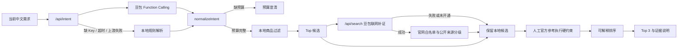

# 智选 Agent：日化用品智能推荐

## [立即体验智选 Agent →](https://zhixuan-agent-cn.plupluto.chatgpt.site)

无需登录。用户可以用中文描述预算、日化品类、肤质、希望获得的功效和需要避开的成分；智选会先整理需求，从本地历史目录筛出候选，再用豆包联网搜索补充可追溯的官网或公开来源。

**[打开智选 Agent](https://zhixuan-agent-cn.plupluto.chatgpt.site)** · [阅读项目文档](#作品集文档) · [查看复现方法](#本地复现)

**[查看 Figma 设计与交互原型](https://www.figma.com/design/0cQqKzVoOS9376uWrMgwGV)** · [阅读设计交付说明](design/figma/README.md)

智选将自然语言需求转换为结构化意图，从离线日化历史商品快照中召回候选，并把历史商品字段与当前品牌官方参考分层呈现。页面保留欢迎、预算澄清、处理、推荐、对比、依据和项目说明等原有状态，不改变既有 UI 布局与交互方式。

> 数据边界：商品对象使用数值字段 `price`，界面固定显示其 `price_label="样本价"`。历史标题提取的 `merchant_claim_tags` 与 `title_ingredient_mentions` 只用于检索，不作为成分或功效事实。高级推荐只对具有当前品牌官方参考及相应资格的少量商品开放；这些跨市场当前参考不反推历史商品配方。

## 当前实现

| 模块 | 实际内容 |
|---|---|
| 商品目录 | 3,497 个去重商品、22 个店铺字段；样本价字段完整率 100%，历史销量或评论信号覆盖率 91.3926% |
| 豆包需求理解 | `/api/intent` 在服务端使用 Agent Plan Responses API 的命名 Function Calling，并在服务端校验完整参数；只发送当前需求文本和输出结构 |
| 本地降级 | 缺少 `ARK_API_KEY`、6 秒超时、上游错误或函数调用无效时，返回确定性本地解析结果 |
| 通用意图流程 | 对所有品类统一处理产品同义词、否定/改口、排除品牌、成分偏好与避雷、预算上下限及不限预算；豆包输出仍须经过确定性规范化 |
| 基础检索 | 按品类、包含/排除产品类型、预算区间和品牌条件过滤，再结合具体功效、肤质、成分偏好、样本价、证据与历史热度排序 |
| 豆包联网发现 | 对涉及敏感肌、成分、功效、品牌或未枚举类型的需求，`/api/search` 才对本地 Top 候选查找官网/公开页；搜索摘要只作线索，不改变硬资格 |
| 官方参考 | 5 个商品具有人工作成的当前品牌官方参考；其中敏感肌资格 3 个、成分避雷资格 4 个、功效资格 4 个 |
| 证据约束 | 敏感肌与成分避雷始终启用核实门槛；普通功效是相关性偏好，只有用户明确要求官方/核实功效时才成为硬门槛，而且必须匹配具体目标功效 |
| 数据质量 | 清洗报告记录重复、日期、数值、关联、缺失和隐私字段边界；项目页展示真实数据质量字段，不显示旧排序模型指标 |

## 系统流程



豆包请求设置 `store: false`。需求解析只发送当前需求。浏览器调用联网接口时只提交最多 3 个商品 ID，服务端用清洗生成的身份白名单重建名称、品牌、品类和产品类型后再发给搜索上游；不发送完整目录、销售聚合或样本价。联网搜索不查询或覆盖价格；界面中的价格仍固定为历史“样本价”。搜索摘要只附加来源，商品是否通过硬约束及最终排序均由本地代码复核。

## 数据产物

两个本地源文件仅作为清洗脚本的只读输入。公开仓库不包含源 CSV、源工作簿、客户编码或订单编码。

| 文件 | 当前内容 |
|---|---|
| `public/data/daily-products.json` | 3,497 个前端商品对象；实际字段包括 `price`、`price_label`、`sales_count`、`review_count`、`merchant_claim_tags`、核实字段、资格与六个 0–1 展示/排序指数 |
| `data/daily_chemicals/verified_product_attributes.json` | 5 条人工整理的当前品牌官方参考；成分为 `string[]`，并保存品牌声明、官方“不含”项、肤质/关注点、来源和匹配边界 |
| `data/daily_chemicals/catalog_quality.json` | 商品快照与销售工作簿的实际清洗计数，以及 5/3/4/4 的核实与资格计数 |
| `data/daily_chemicals/category_sales_summary.json` | 122 条去标识商品编码聚合：`product_code`、大类、小类、订单数、数量和金额 |
| `data/daily_chemicals/product-identities.json` | 3,497 条服务端联网候选身份白名单；只含商品 ID、名称、品牌、品类与产品类型 |
| `public/data/metrics.json` | 项目页使用的商品数、店铺数、样本价完整率、历史信号覆盖率和资格计数 |
| `public/data/manifest.json` | 当前 Schema 版本、商品数、三类来源层、公开文件名及布尔边界；当前不包含文件哈希或生成时间 |

### 当前官方参考边界

- 4 条记录为“同名同规格的当前跨市场参考”，1 条仅匹配到当前系列。
- `ingredients` 中有 2 条完整当前配方、2 条只含关键成分、1 条为当前系列完整参考。
- `ingredient_avoidance=true` 不一律表示拥有完整配方：关键成分记录只对品牌官方明确列出的 `official_formulated_without` 项提供避开判断；未明确列出的项仍视为未知。
- 敏感肌资格来自当前品牌官方页的相关声明，必须写成当前跨市场品牌参考，不能改写成历史配方事实或零风险保证。
- 功效资格来自当前品牌官方声明；界面使用“品牌官方称”等归属措辞，不将其改写为独立医学结论。
- 仅有历史标题的商品仍可参加普通品类和预算检索，但不能参加敏感肌、成分避雷或核实功效结论。

## 本地复现

环境要求：Node.js 22+、Python 3.12+。

```bash
npm install
python3 -m venv .venv
.venv/bin/pip install -r requirements.txt
cp .env.example .env.local
```

编辑 `.env.local`。豆包 Key 可留空以测试本地降级；两个数据路径是重建目录时的必填输入：

```bash
ARK_API_KEY=
ARK_MODEL=doubao-seed-2.0-lite
ARK_BASE_URL=https://ark.cn-beijing.volces.com/api/plan/v3
WEB_SEARCH_API_KEY=
BEAUTY_CSV_PATH="/absolute/path/to/beauty-snapshot.csv"
DAILY_XLSX_PATH="/absolute/path/to/daily-chemicals.xlsx"
```

在 zsh/bash 中载入 `.env.local` 后运行清洗。`npm run data:build` 会把两个环境变量分别传给脚本必填参数 `--beauty-csv` 和 `--daily-xlsx`：

```bash
set -a
source .env.local
set +a
npm run data:build
npm run verify
npm run dev
```

也可以直接传入两个 required 参数：

```bash
.venv/bin/python scripts/build_daily_catalog.py \
  --beauty-csv "/absolute/path/to/beauty-snapshot.csv" \
  --daily-xlsx "/absolute/path/to/daily-chemicals.xlsx"
```

打开 `http://localhost:3000`。`.env*` 已被 Git 忽略，仅 `.env.example` 可提交；不要把真实密钥写入代码、JSON、截图、日志或提交记录。

部署使用 **Agent Plan 专属 Key**。它必须配合 `/api/plan/v3`；通用 API Key 使用普通 `/api/v3`，两类 Key 不混用。智选直接指定 `doubao-seed-2.0-lite`，避免自动路由切换模型，并关闭深度思考以降低需求抽取延迟。配置 `WEB_SEARCH_API_KEY` 时联网使用固定 Search Infinity 上游；未配置时才复用已开通豆包搜索的 Agent Plan Key。两类 Key 都不能写进仓库或浏览器代码。

## 目录结构

```text
├── app/                          # 既有响应式 UI；/api/intent 与 /api/search 为服务端入口
├── lib/agent.ts                 # 通用意图规范、约束复核、排序、联网证据合并与理由
├── lib/web-search.ts            # 固定上游、来源分级、结果清洗与候选映射
├── lib/search-catalog.ts         # 服务端候选 ID 白名单解析
├── scripts/build_daily_catalog.py
│                                  # 两个 required 输入的清洗与公开产物生成
├── data/daily_chemicals/         # 官方参考表、质量报告和去标识聚合
├── public/data/                  # 商品目录、指标和 manifest
├── tests/                        # 数据契约、意图回归、约束、排序与联网来源分级测试
└── docs/                         # PRD、架构、指标与字段说明
```

## 作品集文档

- [产品需求文档（PRD）](docs/产品需求文档_PRD.md)
- [系统架构与 RAG 流程](docs/系统架构与RAG流程.md)
- [数据质量与覆盖说明](docs/实验与指标设计.md)
- [日化商品数据字典](docs/数据字典.md)
- [Figma 设计系统与交互基线](design/figma/README.md)

## 当前限制

- 商品目录是离线历史快照，不提供实时库存、促销、购买链接或行情。
- 只有 5 个商品具有人工作成的当前品牌官方参考，高级推荐覆盖很小。
- 当前参考主要来自跨市场品牌页面；它们不能证明历史中国市场商品使用相同配方。
- `ingredients` 只有字符串列表，没有监管备案、禁限用目录或浓度字段。
- 自动测试覆盖 6 个清洗与发布数据契约，以及 20 个意图/约束/联网来源回归用例；联网来源必须与具体商品名称或类型唯一对应，同品牌但无法区分具体商品的页面会被拒绝。自动测试仍不使用真实 Key，也没有 UI 浏览器回归测试。
- 排序为可解释启发式，不存在真实用户相关性标签，项目不声明推荐准确率或商业提升。

## License 与数据权利

仓库代码及原创文档采用 MIT License。输入源数据、第三方商品名称、商标、品牌页面内容及其派生数据不因进入本仓库而获得新的 MIT 授权。公开仓库不包含原始订单级记录；使用者仍需自行确认数据来源、平台条款、商标和内容使用权。
