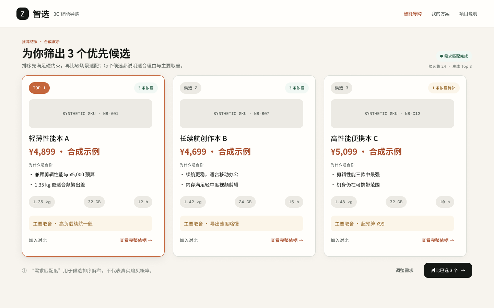
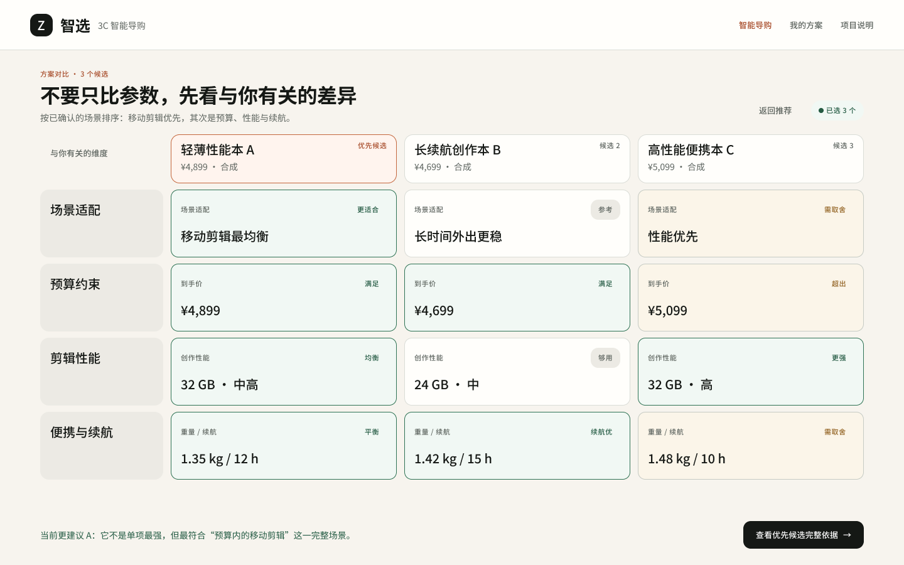
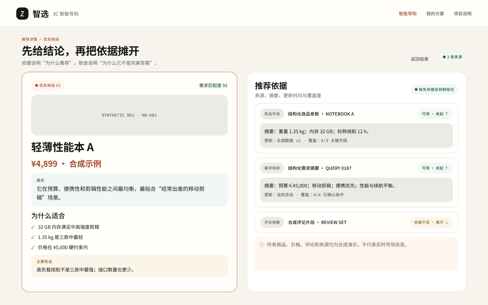
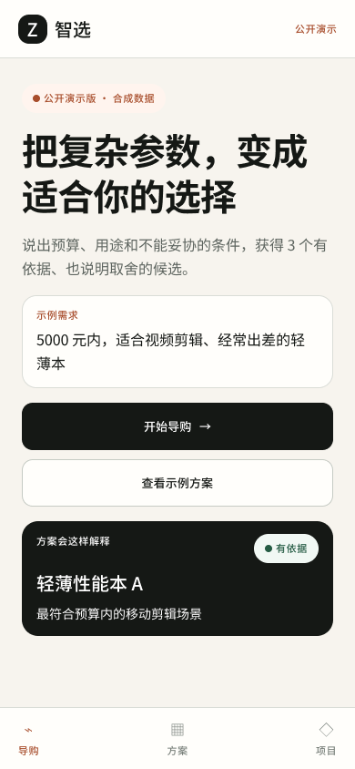
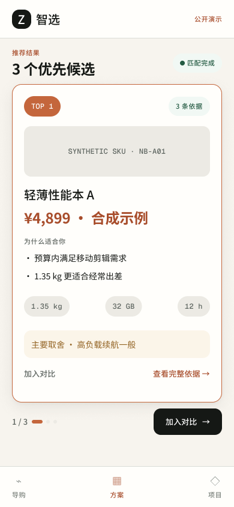
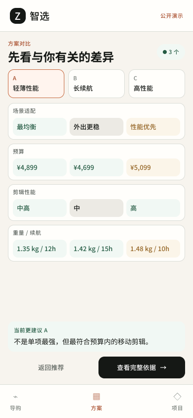
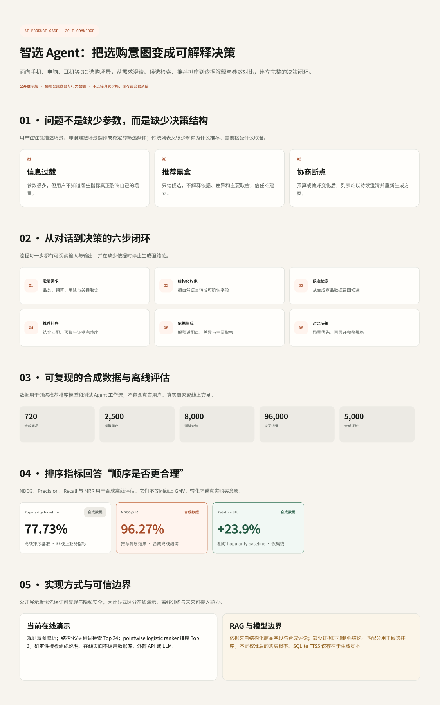
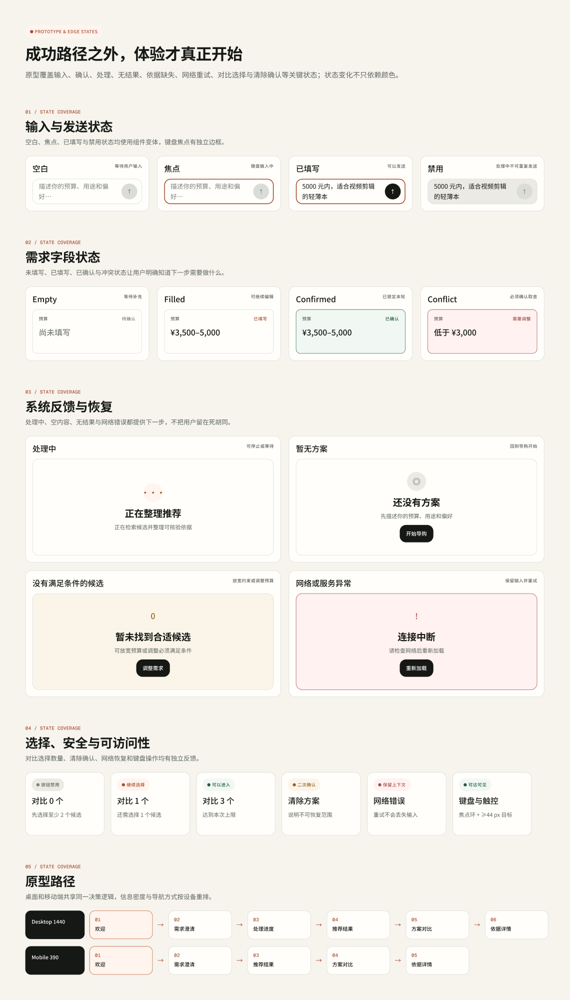
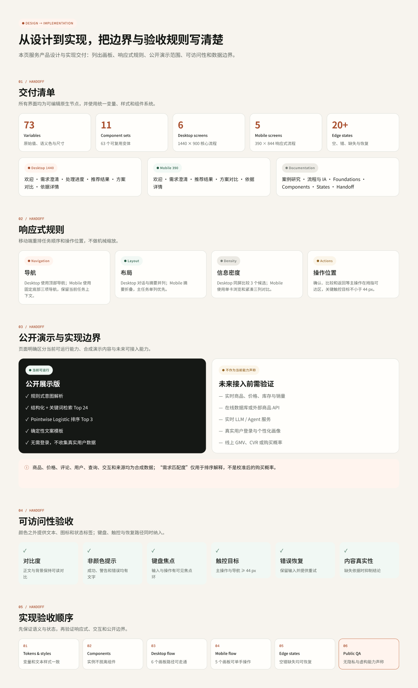

# 智选 Agent｜Figma 产品设计交付

## [打开完整 Figma 文件与交互原型 →](https://www.figma.com/design/0cQqKzVoOS9376uWrMgwGV)

[在线体验公开演示](https://zhixuan-agent-cn.plupluto.chatgpt.site) · [返回项目首页](../../README.md) · [查看设计系统说明](docs/设计系统与原型说明.md)

这套设计把 3C 数码导购从“给出一串商品”重新组织为一条可理解、可确认、可回退的决策路径：先澄清预算、用途和必须满足项，再检索与排序候选，最后把推荐理由、主要取舍和证据来源同时呈现。

## 设计目标

- 让用户先确认需求，再接受推荐，减少系统误解带来的无效结果。
- 将“为什么适合”和“需要接受什么取舍”放在同一层级，避免只展示优势。
- 对商品字段、需求映射和评论摘要分别标注来源、覆盖度与缺失状态。
- 在桌面端支持并列比较，在移动端按单手操作和阅读顺序重新排版。
- 明确公开演示只使用合成数据，不暗示实时商品、库存、销量或购买概率。

## 交付范围

| 模块 | 内容 |
|---|---|
| Foundations | 73 个 Variables、11 个文字样式、3 个阴影样式 |
| Components | 11 个组件集、63 个变体，覆盖按钮、输入、需求字段、推荐卡、证据与反馈状态 |
| Desktop | 6 个 1440 × 900 页面：欢迎、澄清、处理、推荐、对比、依据 |
| Mobile | 5 个 390 × 844 页面：欢迎、澄清、推荐、对比、依据 |
| Prototype | 桌面与移动核心路径、Button Hover、Composer Focus、Evidence 展开/收起 |
| Edge states | 空白、禁用、冲突、处理中、无结果、依据缺失、网络重试、清除确认等 |
| Handoff | 响应式规则、实现边界、可访问性和公开发布验收顺序 |

## 核心界面

### 从需求到推荐

### 从参数到决策

### 移动端重排

| 欢迎 | 推荐 | 对比 |
|---|---|---|
|  |  |  |

## 案例研究与交付说明

## 原型入口

- [Desktop：从欢迎页开始](https://www.figma.com/design/0cQqKzVoOS9376uWrMgwGV?node-id=57-2)
- [Mobile：从欢迎页开始](https://www.figma.com/design/0cQqKzVoOS9376uWrMgwGV?node-id=76-2)
- [组件库](https://www.figma.com/design/0cQqKzVoOS9376uWrMgwGV?node-id=24-2)
- [状态与原型覆盖](https://www.figma.com/design/0cQqKzVoOS9376uWrMgwGV?node-id=91-2)

> 所有商品、价格、用户、查询、评论、交互和证据来源均为合成演示。“需求匹配度”只用于排序解释，不是校准后的购买概率。
