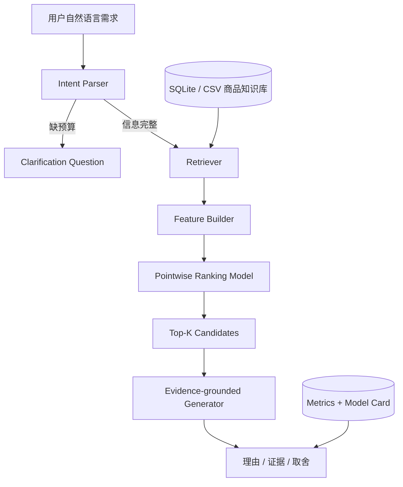

# 系统架构与 RAG 流程

## 1. 总体架构



## 2. RAG 在本项目中的含义

RAG 不是简单地在文案里写“接入知识库”。本项目将其拆成三个可检查环节：

1. **Retrieval**：按品类、预算容差和中文关键词从商品文档召回候选。
2. **Augmentation**：将候选的价格、能力分、评分、亮点和限制组成证据上下文。
3. **Generation**：当前使用确定性中文模板生成理由；所有句子只能引用上下文字段。

这样即使没有在线大模型，整条链路仍可复现、可测试。接入 LLM 后，只替换生成器，不改变检索与排序的证据边界。

## 3. 意图结构

```json
{
  "category": "笔记本电脑",
  "budget": 7000,
  "useCase": "编程开发",
  "primaryPreference": "battery",
  "preferredBrand": null,
  "preferences": {
    "performance": 0.25,
    "battery": 0.31,
    "portability": 0.08
  }
}
```

规则同时承担可解释性和离线降级能力。未来可用大模型输出同一 JSON Schema，并对类型、枚举和预算范围做严格校验。

## 4. 排序特征

模型输入不包含 `relevance_grade`、点击、加购、购买或曝光位置，避免明显标签泄漏。核心特征包括：

- 商品侧：价格、评分、销量、上新时间、11 个能力分。
- 查询侧交叉：预算匹配、品牌匹配、场景能力、核心偏好能力、加权偏好匹配。
- 输出目标：商品达到“相关”或“高度相关”等级的概率。

前端读取 `public/data/ranker.json` 中的标准化参数、系数和截距，复现 Python 的同一线性打分公式。

## 5. 生成约束

- 不允许输出知识库中不存在的品牌、型号或参数。
- 价格、评分、评价数必须直接来自选中商品记录。
- 推荐理由至少包含一个预算证据和一个能力证据。
- 必须展示 `limitations`，避免只讲优点。
- 没有候选时返回放宽预算或品类的建议，不虚构商品。

## 6. 在线大模型扩展接口

推荐的 Prompt 结构：

```text
System: 你是 3C 电商导购。只能使用 <evidence> 中的信息，不得补写参数。
User intent: {validated_intent_json}
Evidence: {top_k_product_documents}
Task: 比较候选，输出推荐理由、主要取舍、适用人群，并逐条标注 product_id。
```

线上需要追加：JSON 输出校验、引用一致性检查、超时重试、模板降级、敏感内容检测、token 成本与 P95 延时监控。

## 7. 部署边界

当前演示全部在浏览器中完成检索和排序，不需要 API Key，也不会上传用户输入。真实环境应将商品库、排序服务和大模型调用放在服务端，并对日志做脱敏和权限隔离。
