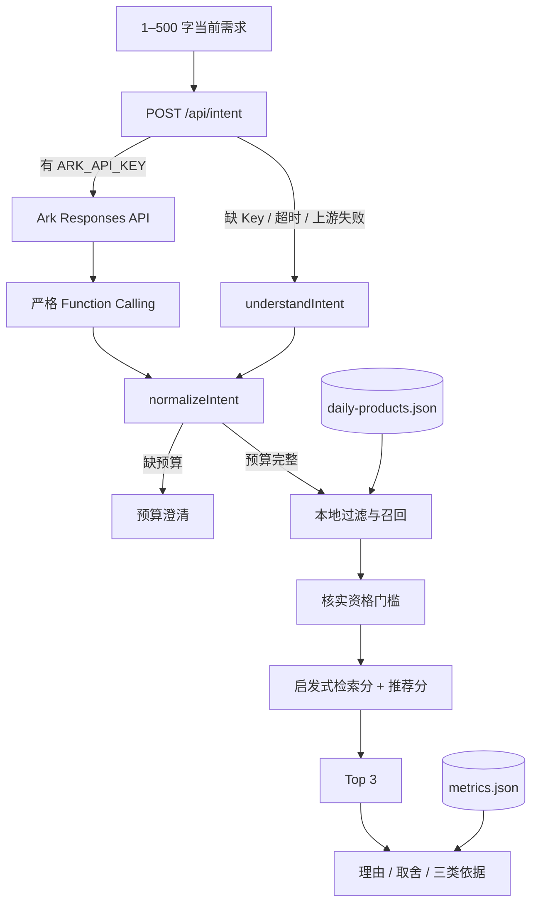

# 系统架构与 RAG 流程

## 1. 实际架构



浏览器加载 `daily-products.json` 与 `metrics.json`。服务端只把当前需求文本、System Prompt 和 Function Schema 发给豆包；商品目录、核实属性表和销售聚合不进入模型请求。

## 2. 本项目中的 RAG

本版的 RAG 是本地证据链，不是让大模型回答商品知识：

1. **Retrieval**：按结构化意图从 3,497 个商品对象过滤，最多保留 36 个候选。
2. **Evidence gating**：敏感肌、明确避开成分或需要核实的功效触发 `recommendation_eligibility` 门槛。
3. **Augmentation**：推荐理由只读取选中商品对象中的历史字段、当前品牌官方参考和证据状态。
4. **Generation**：`lib/agent.ts` 使用确定性模板生成理由与取舍；豆包不参与商品理由生成。

## 3. 数据构建链路

`scripts/build_daily_catalog.py` 有两个 required 参数：`--beauty-csv` 和 `--daily-xlsx`。

### 3.1 商品快照

```text
CSV
  → 检查 update_time / id / title / price / sale_count / comment_count / 店名
  → 删除完全重复行
  → 解析日期和数值，排除无效日期、非正价格和负信号
  → 每个 source_product_id 取最新有效记录
  → 清洗活动词，规则推断 category / product_type
  → 从标题提取 merchant_claim_tags / title_ingredient_mentions
  → 计算 popularity / reviewSignal / value
  → 关联 5 条 verified_product_attributes
  → public/data/daily-products.json
```

当前实际计数：27,598 行输入，删除 86 行完全重复，27,512 行进入快照，输出 3,497 个唯一商品和 22 个店铺字段。301 个商品同时缺少历史销量与评论。

### 3.2 日化销售工作簿

```text
销售订单表 + 商品信息表
  → 删除完全重复行
  → 解析日期、数量、单价和金额
  → 排除无效日期、无效数值和无法关联商品的行
  → 按 商品编号 / 大类 / 小类 聚合
  → category_sales_summary.json
```

当前实际计数：31,452 行订单输入，删除 6 行重复、1 行日期异常、4 行数值异常、1 行无法关联；31,440 行用于 122 个商品编码聚合。输出字段只有 `product_code`、`category`、`subcategory`、`order_count`、`quantity` 和 `amount`。

### 3.3 输出

- `public/data/daily-products.json`：前端商品目录；
- `public/data/metrics.json`：项目页指标；
- `public/data/manifest.json`：Schema、来源层、公开文件名和布尔边界；
- `data/daily_chemicals/catalog_quality.json`：实际清洗计数与资格计数；
- `data/daily_chemicals/category_sales_summary.json`：去标识商品编码聚合。

当前 manifest 不生成文件哈希、字节数或生成时间。

## 4. 服务端豆包接口

### 4.1 请求约束

`POST /api/intent` 接受 `{ "query": string }`：

- Content-Length 大于 4,096 字节返回 413；
- 空字符串或长度超过 500 字返回 400；
- 正常豆包结果与本地降级结果显式返回 `Cache-Control: no-store`；当前 400/413 输入错误分支没有单独设置该响应头。

### 4.2 Ark 调用

- 默认地址：`https://ark.cn-beijing.volces.com/api/v3`；
- `ARK_BASE_URL` 只有以上述官方前缀开头时才会采用；
- 默认模型：`doubao-seed-2-0-lite-260215`，可由 `ARK_MODEL` 覆盖；
- `store: false`；
- 严格函数名：`extract_personal_care_intent`；
- 429、502、503、504 最多重试一次，退避 220–399 ms；
- 整体 AbortController 超时为 6 秒。

失败返回本地 `understandIntent(query)`，并带 `provider: local-fallback` 与原因分类。成功返回 `provider: doubao`。接口没有把上游完整响应或 API Key返回给浏览器。

### 4.3 Function 字段

远端函数包含：

```json
{
  "category": "护肤",
  "productTypes": ["乳液"],
  "budgetMin": null,
  "budgetMax": 200,
  "skinType": "油性",
  "sensitiveSkin": true,
  "concerns": ["保湿"],
  "desiredEffects": ["保湿"],
  "avoidIngredients": ["fragrance"],
  "preferredIngredients": [],
  "avoidFragrance": true,
  "preferredBrands": [],
  "excludedBrands": [],
  "keywords": ["乳液", "保湿"],
  "needsClarification": false,
  "clarificationField": null,
  "confidence": 0.9
}
```

Function Schema 对品类、肤质、关注问题、数组数量、澄清字段和置信度设定约束。`normalizeIntent` 忽略应用未使用的额外内容、规范预算和成分同义词，并生成本地排序所需字段。当前没有已知过敏史、质地偏好或 `medical_red_flag` 等医疗风险字段。

当前 UI 只实现预算澄清：没有预算时进入澄清页并显示预算按钮。即使远端返回其他 `clarificationField`，当前推荐流程不会展示专门的品类、肤质或功效追问界面。

## 5. 商品与证据结构

### 5.1 历史商品层

可用于基础过滤和排序的实际字段包括：

- `product_id`、`name`、清洗后的 `source_title`；
- `category`、`product_type`；
- `brand`、`shop_name`；
- `price` 与固定 `price_label="样本价"`；
- 可空的 `sales_count`、`review_count`；
- `merchant_claim_tags`、`title_ingredient_mentions`；
- `popularity`、`reviewSignal`、`value`。

对没有官方参考的商品，`brand` 实际使用店铺名，不能一律视为已核实品牌。标题功效和成分词都是未核实检索标签。

### 5.2 当前品牌官方参考层

`verified_product_attributes.json` 当前有 5 条记录。其实际字段包括：

- `source_product_id`、匹配用历史标题、标准品牌与商品名、规格；
- `match_status`、`formula_market`、`formula_version_label`、`formula_checked_at`；
- `ingredient_list_completeness` 与 `ingredients: string[]`；
- `official_formulated_without`、`official_skin_types`、`official_concerns`；
- `brand_claims`、四类 `recommendation_eligibility`、`evidence_sources` 和 notes。

当前匹配状态为 4 条 `exact_name_size_current_cross_market` 和 1 条 `canonical_series_only`。它们是当前品牌官方参考，不证明历史中国市场配方。当前表没有监管备案、禁限用目录、浓度或香料过敏原专用字段。

## 6. 过滤与排序

### 6.1 硬过滤

`eligible()` 当前检查：

1. 规范化品类；
2. 产品类型；
3. `budgetMin` 和预算上限；
4. 排除品牌；
5. 敏感肌资格；
6. 需要核实证据时的功效资格；
7. 成分避雷通过状态。

### 6.2 成分避雷

成分词先通过有限同义词表标准化。商品必须具有 `ingredient_avoidance=true`：

- 避开项出现在 `normalized_ingredients` 时排除；
- 出现在 `normalized_formulated_without` 时放行；
- `ingredient_list_completeness=full` 时，完整列表未命中可放行；
- `key_only` 没有明确“不含”时不能据缺失推断安全，因而排除；
- 对 alcohol，官方明确 `drying alcohol` 不含可满足当前专门兼容规则。

`full_current_reference` 当前没有设置成与 `full` 相同的缺省未命中放行；相关商品也没有成分避雷资格。

### 6.3 分数

检索分由样本价匹配、关键词、核实功效匹配、品牌、官方参考状态与历史热度组成。推荐分再融合六个 0–1 指数：

- `efficacy`；
- `sensitivity`；
- `ingredientTransparency`；
- `value`；
- `popularity`；
- `reviewSignal`。

其中 `efficacy` 对历史标题商品可能含低权重标题标签启发值，不能单独作为核实功效证据。高级功效模式另有 `recommendation_eligibility.efficacy` 门槛。

## 7. 推荐理由

模板可输出：

- 样本价在预算内；
- 当前品牌官方页的敏感肌相关声明，并明确是跨市场参考；
- 品牌官方明确列出的“不含”项；
- 当前官方完整成分参考未命中用户避开项；
- 品牌官方产品页可对应的功效；
- 普通模式下的历史热度信号；
- 只有历史标题、成分与功效未核实的限制。

没有候选时，高级模式明确不会用未核实标题补齐结论；普通模式建议调整预算或品类。

## 8. 当前自动测试边界

`tests/test_data_pipeline.py` 当前验证：

- 活动词从展示标题移除；
- 商品快照去重、取最新记录、缺失历史信号保留 `null`；
- 工作簿混合日期、数值后缀、重复和孤儿行处理；
- 发布目录恰有 3,497 个唯一商品和 5 个官方参考；
- 公开商品不暴露日期、客户/订单字段或活动词，且价格标签为“样本价”；
- 六个指数有限且在 0–1，敏感肌资格记录具有官方参考和来源。

当前没有 `/api/intent` 自动测试、真实豆包联调测试、浏览器 UI 回归测试、manifest 哈希测试或 `medical_red_flag` 等医疗风险测试。

## 9. 部署边界

- `ARK_API_KEY`、`ARK_MODEL`、`ARK_BASE_URL` 只由服务端环境读取；
- `.env.local` 与其他 `.env*` 不提交；
- 前端公开 JSON 不包含用户输入、API Key、客户编码或订单编码；
- 无 Key 时基础体验使用本地规则；
- 当前参考主要为跨市场品牌页面，只能按来源和版本边界展示。
